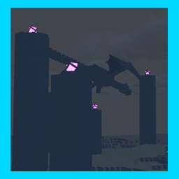

# LethalCompany_TheEndMoon

添加末地作为新的moon！

描述："The End" is a dark dimension resembling outer space, floating within the void.
High risk, high reward place.

危险等级：S

费用：500

工厂地牢权重：100

旅馆地牢权重：100

说明：这个星球极其危险，伫立于虚空中的岛屿，翱翔于黑曜石柱间的巨龙虎视眈眈，即使是设施外也不再安全！

设施生成：工厂和旅馆的地牢生成概率一致

如果你也想加入更新团队，可以去我的github上一起制作！

采用了LethalExpansion作为前置模组

模型来源：https://sketchfab.com/3d-models/

参考教程：https://github.com/HolographicWings/LethalSDK-Unity-Project/

# 1.3.1

调整了设施内的废品生成，移除了LethalExpansion中出现的废品依赖

# 1.3.0

为末影龙和末影人增加了音效，或许这听起来更加炫酷OvO

修复了消防门导航到虚空的问题，现在不会出现两个消防门“串门”问题

完全摆脱了LethalExpansion的前置需求，现在只需要LethalExpansionCore作为前置模组即可，这意味着可能与更多模组兼容（例如LethalLevelLoader）

# 1.2.0

考虑到新版本摔落伤害增加，调整了末地船的位置

修复了末影水晶的旋转动画

后续会解决末影龙的音效

# 1.1.0

调整了废品生成，现在增加了LethalSDK原本的废品，并且添加了我的“MinecraftScraps”作为前置模组，现在是真正意义上的高风险高回报！

# 1.0.0

正式添加“The End”作为新的MOON，但仍然有一些小问题未解决：例如末影龙的音效，多个红门只有一个有效，末影水晶的动画失效等问题，但是会在后续版本逐步完善！

